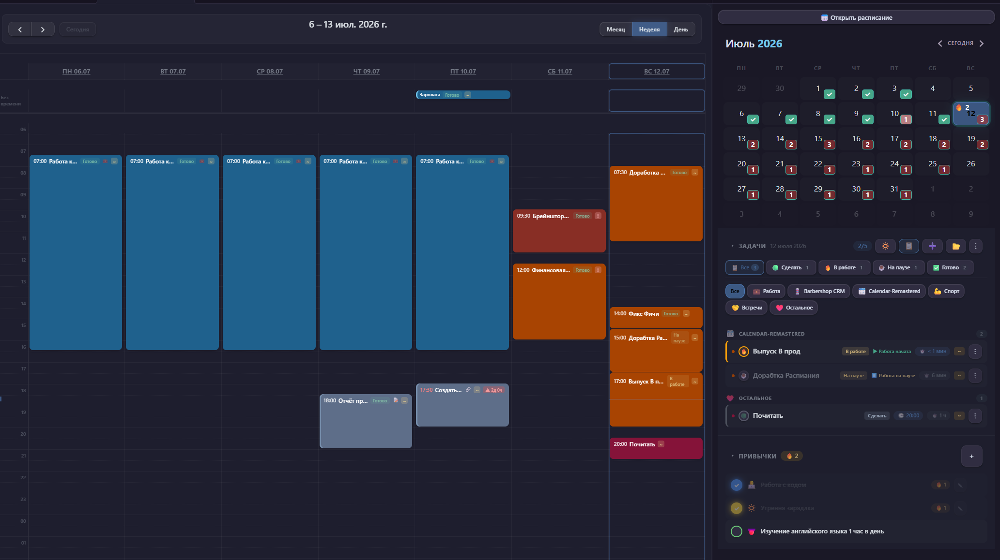
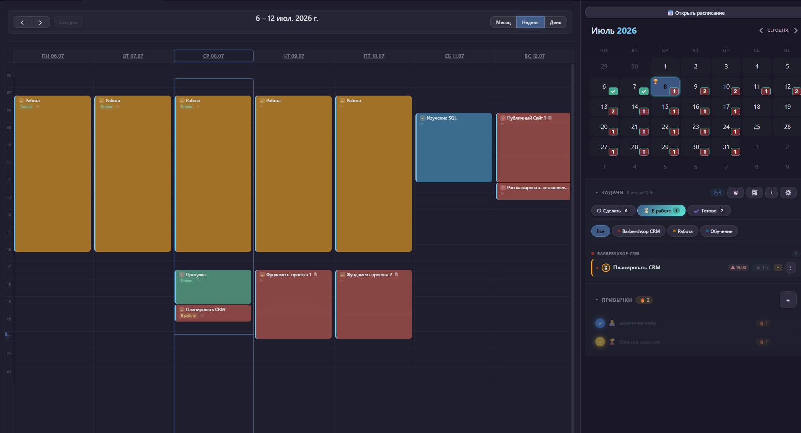
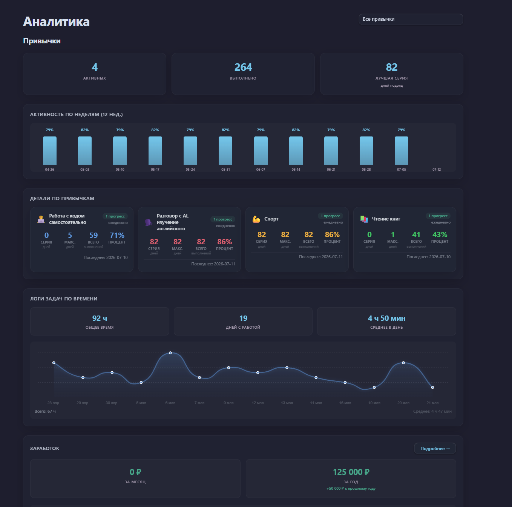

# 📅 Calendar Plugin Remastered

Календарь, трекер задач и привычек — всё в одном плагине для [Obsidian](https://obsidian.md).
Разработан на основе [Calendar](https://github.com/liamcain/obsidian-calendar-plugin) от Liam Cain.

---

## Что умеет плагин

### 📆 Календарь
Месячный вид с индикаторами серий выполнения задач и Привычек.

### 🗓️ Расписание
Полноценный планировщик на базе **FullCalendar**:
- Дневной, недельный и месячный виды
- Создание задач одним кликом по свободному слоту
- Перетаскивание событий (drag & drop) для изменения времени
- Цветовая индикация проектов
- Адаптация под мобильные устройства (свайпы, тач-таргеты)

### ✅ Трекер задач
Мини-канбан с четырьмя статусами:
- **Сделать** — задачи к выполнению
- **В работе** — задачи в процессе (с таймером)
- **На паузе** — приостановленные задачи (таймер на паузе)
- **Готово** — выполненные задачи

Возможности:
- Проекты с цветовой маркировкой
- Приоритеты (высокий, средний, низкий)
- Повторяющиеся задачи (ежедневные, еженедельные, ежемесячные)
- Встроенный таймер учёта времени с логами
- Привязка задач к заметкам Obsidian
- Архивация выполненных задач
- Автоматическая очистка выполненных задач (более 180, чтобы не засорять память)

### 🔁 Трекер привычек
- Ежедневные и еженедельные привычки
- Настройка иконок и цветов для каждой привычки
- Автоматический подсчёт серий выполнения

___

## Дополнительные фичи плагина

### 💼 Рабочие задачи
Учёт заработка из выполненных задач:
- Пометка задач как "Рабочие"
- Тип оплаты: почасовая или повременная
- Автоматический расчёт заработка
- Бейдж "💼 Рабочая" в списке задач и расписании
- Сумма заработка отображается в аналитике

### 💰 Распределение финансовых средств
Личный финансовый трекер:
- **Общий баланс**: поступления, расходы, остаток
- **Основной счёт**: обязательные расходы (еда, интернет, связь и т.д.)
- **Цели на месяц**: Планируем цели на месяц
- **Куда отложить**: планирование накоплений
- **Правила распределения**: настройка приоритетов
- Переключатель источника поступлений (*из аналитики* / *вручную*)
- Предупреждение при превышении бюджета
- Данные хранятся по месяцам для ведения истории

### 📊 Аналитика
- График активности за последние 12 недель (в стиле GitHub)
- Визуализация логов по задачам и привычкам
- Статистика: текущая серия, лучшая серия, процент выполнения за 30 дней
- **Заработок**: за месяц, за год, помесячный график

___

🔽Нажми, чтобы посмотреть скриншоты🔽

___

___

### 🔔 Уведомления
Нативные системные напоминания о задачах (от 1 до 60 минут до начала) и оповещения о просроченных делах.

### 🔄 Синхронизация
Все данные хранятся в файле `calendar-data.json` в корне хранилища. Плагин полностью совместим с **Obsidian Sync** и **Remotely Save** — ваши задачи и привычки всегда под рукой на любом устройстве.

---

## Установка

### Через BRAT (рекомендуется)
1. Установите плагин [BRAT](https://github.com/TfTHacker/obsidian42-brat)
2. Откройте настройки BRAT → **Add Beta Plugin**
3. Вставьте URL: `https://github.com/AtinsS/obsidian-calendar-plugin-remastered`

### Вручную
Скачайте `main.js`, `manifest.json` и `styles.css` из раздела [Releases](https://github.com/AtinsS/obsidian-calendar-plugin-remastered/releases) и скопируйте их в папку `.obsidian/plugins/calendar/` внутри вашего хранилища.

---

## Настройки

| Параметр | По умолчанию |
|----------|--------------|
| Первый день недели | Как в системе |
| Трекер задач / привычек | Включено |
| Архивация завершённых задач | Выкл. |
| Папка для архива | `Archive` |
| Синхронизация данных в хранилище | Вкл. |
| Уведомления | Выкл. |
| Напоминание за | 15 минут |
| Тип оплаты по умолчанию | В час |
| Ставка по умолчанию | 0 ₽ |

---

## Технологический стек

[Svelte 3.x](https://svelte.dev/) · [FullCalendar 6.x](https://fullcalendar.io/) · [Luxon 3.x](https://moment.github.io/luxon/) · [TypeScript 4.x](https://www.typescriptlang.org/) · Canvas API

---

## Что ещё хочу добавить?

- Телеграмм-бот с напоминаниями (может быть не только)

---

## Поддержать проект

Если плагин оказался полезным:

- ⭐ Поставьте звезду репозиторию — это лучшая мотивация
- ☕ [Угостить автора кофе с булочкой](https://pay.cloudtips.ru/p/cbaa3c81)

---

Сделано с 💜 для сообщества Obsidian

